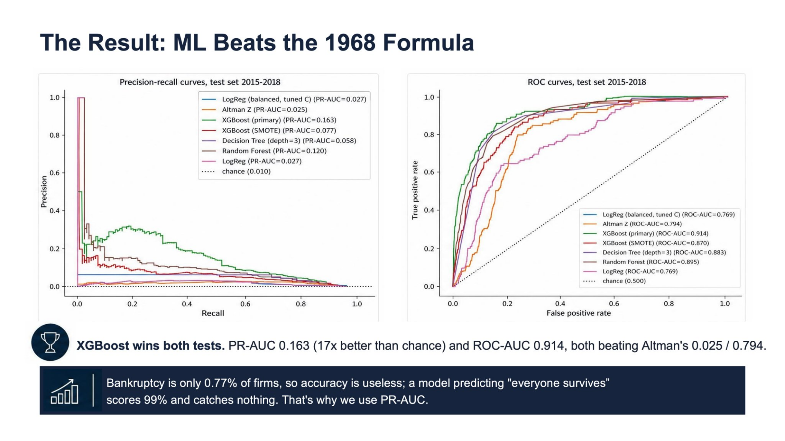
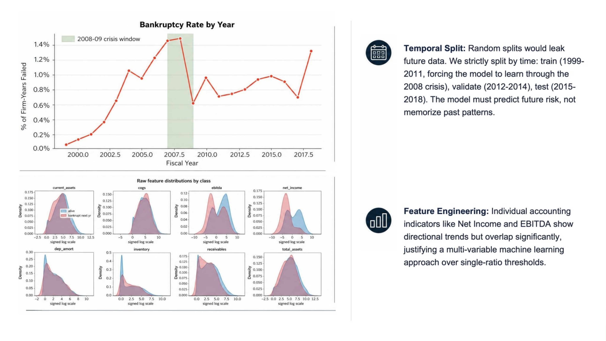
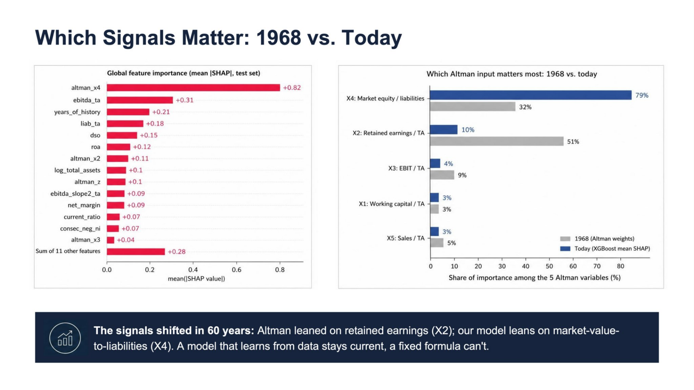

# Bankruptcy Risk Screener

A tool that reads a US public company's yearly financial statements and estimates the chance it files for bankruptcy within the next year. It runs on a calibrated XGBoost model trained on 20 years of NYSE and NASDAQ filings, benchmarked against the Altman Z-Score, the formula the finance industry has leaned on since 1968, to see whether modern machine learning actually reads the same statements more accurately. Built using Python, pandas, scikit-learn, and XGBoost as part of AI4ALL's Ignite accelerator.

The project started as exploratory analysis on the raw Kaggle dataset in a single notebook, and the biggest turning point was discovering a label leakage bug, where every historical row of a company that eventually failed was marked "failed" instead of only its final year. Fixing that reshaped the entire target definition. From there the project grew from a one-off notebook into a tested, deployable pipeline: six staged analysis notebooks, a `src/` package with its own test suite, and a Streamlit app, with SHAP-based explanations added last, once the core model was already validated.

## Problem Statement <!--- do not change this line -->

Companies fail for all kinds of reasons: a debt load that outgrows the business, a downturn that never reverses, or years of shrinking margins nobody caught in time. Most of these failures never make the news, yet investors, creditors, and employees are often left with no warning before a bankruptcy filing.

For nearly 60 years, the standard answer has been the Altman Z-Score, a single formula built in 1968 from five financial ratios pulled straight off a balance sheet. It is simple and transparent, but finance has changed a lot since 1968. This project asks whether a modern machine learning model can read the same financial statements more accurately than a decades-old linear formula, and whether it can do so while staying explainable enough for a human to trust and act on.

A working early-warning signal gives creditors, investors, and employees months of notice instead of a surprise filing, and a transparent, SHAP-explained tool like this one is a free alternative to opaque commercial credit-risk scores.

## Key Results <!--- do not change this line -->

1. Built a calibrated XGBoost model on 78,682 US public company firm-years (1999-2018) from NYSE and NASDAQ filings, with roughly 609 true bankruptcy events (a 0.77% base rate).
2. Benchmarked XGBoost against Logistic Regression, a Decision Tree, Random Forest, XGBoost with SMOTE resampling, and the classical 1968 Altman Z-Score formula on a held-out 2015-2018 test set:

   | Model | ROC-AUC | PR-AUC | F1 | Precision | Recall |
   |---|---|---|---|---|---|
   | Altman Z (1968 baseline) | 0.794 | 0.025 | 0.041 | 0.021 | 0.882 |
   | Logistic Regression | 0.769 | 0.027 | 0.066 | 0.036 | 0.361 |
   | Decision Tree (depth=3) | 0.883 | 0.058 | 0.124 | 0.068 | 0.723 |
   | Random Forest | 0.888 | 0.116 | 0.160 | 0.105 | 0.345 |
   | XGBoost (SMOTE) | 0.844 | 0.061 | 0.134 | 0.120 | 0.151 |
   | XGBoost (primary) | 0.905 | 0.200 | 0.255 | 0.181 | 0.429 |
   | **XGBoost (calibrated, deployed)** | 0.902 | 0.189 | 0.223 | 0.169 | 0.328 |

3. XGBoost roughly doubled Logistic Regression's PR-AUC and beat Altman's F1 by about 5x, meaning it ranks true bankruptcies far higher among its top alerts. Altman's headline recall of 0.88 looks strong on its own, but it comes with precision of only 0.02, meaning it flags almost every company and cannot actually prioritize review by itself.
4. Calibration dropped the model's Brier score from 0.079 raw to 0.0089 calibrated, which is why the calibrated version, not the higher-F1 primary model, is the one deployed in the app.
5. Discovered and fixed a label leakage bug in the raw dataset, where every historical row of a company that eventually failed was marked "failed," not just its final year. Correcting this reshaped the entire target definition and was a bigger factor in getting a trustworthy model than any single hyperparameter choice.

*XGBoost (primary) leads both curves, reaching a PR-AUC 17 times better than random chance and clearly separating from the Altman Z-Score baseline on both metrics.*

*Bankruptcy rates spike around the 2008-09 financial crisis, which is why the train/validation/test split is chronological rather than random. Features like EBITDA and net income show visibly different distributions between firms that stayed alive and firms that failed the following year.*

## Methodologies <!--- do not change this line -->

**Model:** a calibrated XGBoost model, a gradient-boosted ensemble of decision trees, used as a binary classifier.

**Inputs:** an engineered feature set built from 18 raw financial statement fields per firm-year, including the Altman Z-Score's five components, profitability ratios (ROA, EBITDA/total assets, margins), leverage ratios (liabilities/total assets, long-term debt/total assets), liquidity ratios (current ratio, inventory turnover, days sales outstanding), year-over-year and 2-year trend features, structural flags like consecutive years of negative net income, and an unsupervised industry cluster label.

**Output:** a calibrated probability that the company files for bankruptcy within the next year, bucketed into Lower, Elevated, or High risk bands.

**Data splitting:** by time, not randomly, to prevent the model from ever seeing a company's future: 1999-2011 for training, 2012-2014 for validation, 2015-2018 for testing. Cross-validation folds also use grouped exclusion, removing any firm with a row in a fold's validation window from that fold's training set entirely, to prevent firm-level leakage.

**Calibration:** XGBoost was tuned by time-series cross-validation on the training years, then calibrated with Platt scaling fit on the validation set, so its output probabilities are trustworthy, not just well-ranked.

**Why XGBoost:** it won on PR-AUC and F1 against every other candidate at this roughly 1% base rate, while staying tree-based enough to support SHAP explanations for every individual prediction. That combination, the best test-set ranking performance plus interpretability, is why it is the model deployed in the app, rather than a less transparent model that might trade away the SHAP explanations.

## Impact & Bias

**Positive effects:** a working early-warning signal helps creditors, lenders, investors, and employees plan ahead instead of being surprised by a filing, and it offers a free, explainable alternative to opaque commercial credit-risk scores. Because every prediction comes with a SHAP breakdown, a user can check whether the reasoning behind a score makes sense rather than trusting a black box.

**Negative effects:** at roughly 17-18% precision, most companies the model flags are false alarms. Careless or public use of a risk score could unfairly damage a healthy company's reputation, financing terms, or stock price. On the other side, false negatives could give lenders or employees false reassurance about a firm that does go on to fail.

**Bias:** the model is trained only on public NYSE and NASDAQ filers from 1999-2018, so it inherits survivorship bias: firms that were quietly delisted or acquired for reasons unrelated to failing are not separated from firms that stayed genuinely healthy, and it has never seen data past 2018, including any COVID-era shock. The unsupervised industry cluster feature could also encode sector-level bias, for example penalizing capital-intensive industries like utilities or manufacturing that naturally run worse liquidity ratios than services firms, even when both are healthy for their own sector.

*SHAP shows the model leans most heavily on market-value-to-liabilities, while Altman's original formula weighted retained earnings most heavily. The financial warning signs that matter most have shifted since 1968, and SHAP is what lets every individual prediction be checked against that reasoning rather than trusted blindly.*

**Mitigation:** an automated drift check flags when new input diverges from the training reference statistics, and the project positions this tool as a screening and triage aid for human review, not an automated accept or reject decision. Those two guardrails are what keep the biases above from silently compounding once the model is in use.

## Data Sources <!--- do not change this line -->

**Dataset:** Kaggle American Bankruptcy dataset, 78,682 US public company firm-years (1999-2018) from NYSE and NASDAQ filings: [kaggle.com/datasets/utkarshx27/american-companies-bankruptcy-prediction-dataset](https://www.kaggle.com/datasets/utkarshx27/american-companies-bankruptcy-prediction-dataset).

**Citations:**

1. Altman, E. I. (1968). Financial Ratios, Discriminant Analysis and the Prediction of Corporate Bankruptcy. *The Journal of Finance*, 23(4), 589-609.
2. Shumway, T. (2001). Forecasting Bankruptcy More Accurately: A Simple Hazard Model. *The Journal of Business*, 74(1), 101-124.
3. Chen, T., & Guestrin, C. (2016). XGBoost: A Scalable Tree Boosting System. *Proceedings of the 22nd ACM SIGKDD*, 785-794.
4. Lundberg, S. M., & Lee, S.-I. (2017). A Unified Approach to Interpreting Model Predictions. *Advances in Neural Information Processing Systems*, 30.
5. Lombardo, G. et al. (2022). Machine Learning for Bankruptcy Prediction in the American Stock Market. *Future Internet*, 14(8), 244.
6. Administrative Office of the U.S. Courts. (2026). Bankruptcy Filings Rise 11 Percent. uscourts.gov.
7. Hayes, A. (n.d.). Understanding the Altman Z-Score Formula and Its Interpretation. Investopedia.

**Code and documentation:** the full project, including all six analysis notebooks, the trained model pipeline, and the Streamlit app, is at [github.com/alexreifel/AI4All-Ignite-Group-23C](https://github.com/alexreifel/AI4All-Ignite-Group-23C).

## Technologies Used <!--- do not change this line -->

- Python 3.11
- pandas, NumPy
- scikit-learn, XGBoost
- imbalanced-learn (SMOTE)
- SHAP
- Streamlit
- Jupyter, Matplotlib, seaborn
- pytest, ruff
- GitHub Actions

## Next Steps

- Retrain and re-validate on 2019 and later data to see how the model handles a post-2018, COVID-era shock it has never encountered.
- Reduce the survivorship-bias scope by extending beyond NYSE and NASDAQ-listed firms, if a suitable data source is found.
- Replace the unsupervised K-Means industry cluster with an explicit, auditable industry code such as SIC or GICS, to make the sector-level bias discussed above easier to inspect and correct.
- Explore cost-sensitive or user-tunable thresholds, since different audiences, like a lender versus a jobseeker, tolerate different false-positive rates, rather than shipping one fixed threshold for everyone.
- Extend the Streamlit app itself, for example with portfolio-level batch monitoring or alerting, building on the CSV batch screening and SHAP explanation work already shipped.

## Authors <!--- do not change this line -->

This project was completed in collaboration with:
- Michelle Jiang
- Alex Reifel
- Palak Goindwani
- Abdurrahman Oyediran
- Rashid Mikidadi
- Edomias Zerihun
